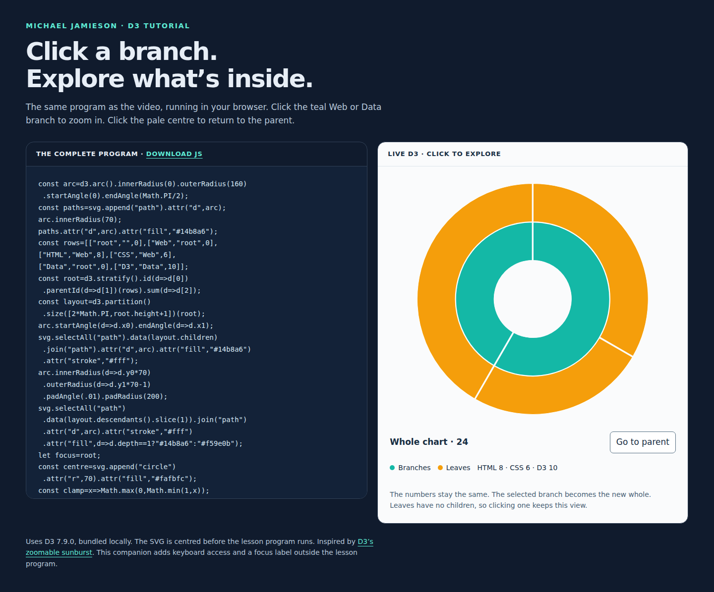

# D3 Drill-Down Sunburst

A small, runnable companion to Michael Jamieson’s **D3 Drill-Down Sunburst: Click, Zoom, and Go Back** tutorial. The code stays beside the live chart so you can explore what each part does.

[Watch the complete tutorial on YouTube](https://www.youtube.com/watch?v=dPHyKLzxrnw).



## Run it

[Download the example](https://github.com/michaeljamieson10/d3-drill-down-sunburst/archive/refs/heads/main.zip), unzip it, and open **index.html** in a modern browser. D3 7.9.0 is included locally, so no package installation, build step, or internet connection is needed.

You can also clone it:

```sh
git clone https://github.com/michaeljamieson10/d3-drill-down-sunburst.git
cd d3-drill-down-sunburst
```

Then open `index.html`.

## Explore the chart

- Click the teal **Web** branch to see HTML and CSS fill the ring.
- Click the pale centre or **Go to parent** to return.
- Click **Data** to see its D3 child.
- Leaf nodes have no drill-down handler. Clicking a leaf keeps the current view.
- Tab and Enter or Space provide keyboard navigation.

The values never change. The selected branch becomes the new whole:

| Leaf | Value | Share of the whole chart | Share of its parent |
| --- | ---: | ---: | ---: |
| HTML | 8 | 33.3% | 57.1% of Web |
| CSS | 6 | 25.0% | 42.9% of Web |
| D3 | 10 | 41.7% | 100% of Data |

## Read the lesson

[`sunburst.js`](sunburst.js) is the exact 48-line program shown in the video, including the early wedge-building statements that introduce the chart progressively.

The first half creates the hierarchy and partitions it into angles and radial depths. The second half remembers the selected node, maps its angular span onto a full circle, moves its children inward, and interpolates the coordinates over 750 milliseconds. Clicking the centre uses the same zoom function with the current node’s parent.

`index.html` supplies the centred SVG, displays the source, and adds keyboard controls and the focus label around the lesson program. The dataset is intentionally small so each change is easy to follow.

## References and licensing

- [D3’s zoomable sunburst example](https://observablehq.com/@d3/zoomable-sunburst)
- [D3 partition layout](https://d3js.org/d3-hierarchy/partition)
- [D3 transitions](https://d3js.org/d3-transition)
- [Previous tutorial: build the starting sunburst](https://www.youtube.com/watch?v=RV7u0ui4kio)

The companion’s original code is available under the [ISC license](LICENSE). The bundled D3 library retains Mike Bostock’s [ISC license](D3-LICENSE).
